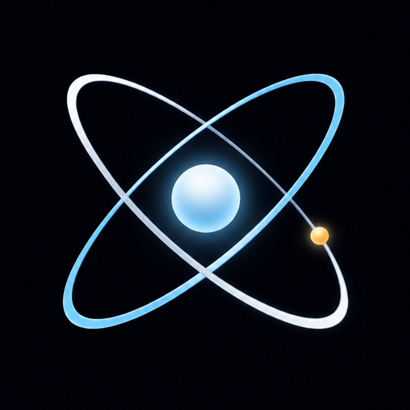

<div align="center">
  

  # Orbital Atlas

  **A solar system made to wander.** An interactive Three.js atlas that pairs scientific orbital data with cinematic exploration and locally packaged, high-resolution planetary assets.

  `Three.js` · `TypeScript` · `Vite` · `J2000 / Kepler`

  [简体中文](./docs/README.zh-CN.md)
</div>

<br />


<div align="center"><sub>Overview mode · planetary paths, asteroid belt, Milky Way, and spectral star field</sub></div>

## Overview

Orbital Atlas brings J2000 orbital elements and Keplerian motion into the browser. Every body has its own orbit, rotation, and axial tilt. Display radii and orbital distances use separate observable compression curves so the Solar System remains explorable in a single view.

| Explore | Render | Experience |
| --- | --- | --- |
| Select bodies, browse the catalog, take a guided tour, use cinematic mode, or fly freely | Local observation textures, a procedural Sun, day-night atmospheres, Saturn's rings, and ACES tone mapping | Responsive HUD, keyboard navigation, WebGL status handling, and reduced-motion support |

## Earth, up close


<div align="center"><sub>Body profile · independent cloud, night-light, and elevation layers paired with a synchronized focus camera</sub></div>

## Features

- Kepler-solved planetary and lunar paths with independently animated rotation and axial tilt
- Procedural photosphere, corona, and magnetic loops; GPU-instanced asteroids and stars
- ACES Filmic tone mapping, threshold Bloom, directional solar light, and atmospheric falloff
- Body catalog, focus profiles, cinematic mode, guided tour, and keyboard-friendly free flight
- Toggleable orbit lines, responsive controls, and shared visual quality on desktop and mobile
- WebGL context-loss messaging, automatic background pause, and `prefers-reduced-motion` / `prefers-reduced-transparency` fallbacks

## Quick start

```bash
pnpm install
pnpm dev
```

Build and preview the production bundle:

```bash
pnpm build
pnpm preview
```

Validate TypeScript without emitting files:

```bash
pnpm typecheck
```

## Controls

| Input | Action |
| --- | --- |
| Drag / scroll / pinch | Orbit and adjust viewing distance |
| Select a body or open **Bodies** | Focus a body and open its profile |
| <kbd>Space</kbd> | Pause or resume time |
| <kbd>[</kbd> / <kbd>]</kbd> | Decrease / increase the time rate |
| <kbd>T</kbd> | Start or stop the guided tour |
| <kbd>Esc</kbd> | Return to overview |
| <kbd>W</kbd><kbd>A</kbd><kbd>S</kbd><kbd>D</kbd>, <kbd>Q</kbd>/<kbd>E</kbd>, <kbd>Shift</kbd> | Free-flight movement, elevation, and acceleration |

## Scientific scope and asset provenance

Orbital eccentricity, inclination, periods, rotation, and axial tilt use JPL/NASA approximate parameters. Observation colour, model textures, and render-derived materials are deliberately distinguished: NASA, USGS, and NOAA archives do not provide a complete, uniform PBR set for every world, and gas and ice giants are never presented as possessing measured solid-surface elevation data.

Venus uses a Magellan radar-derived surface baseline beneath an opaque procedural cloud deck. Saturn's colour map is credited to NOAA Science On a Sphere, while its ring texture is extracted from NASA VTAD's Saturn GLB. Uranus and Neptune retain the 1024 × 512 textures provided by NASA VTAD source GLBs; no higher-resolution observation claim is made.

Final assets are preprocessed and packaged locally: Venus, Earth, and Mars colour maps are 4096 × 2048; Earth cloud, night-light, and elevation layers plus Mars elevation are also 4096 × 2048; Jupiter is 3601 × 1801; Saturn is 2880 × 1440 with a 4096 × 16 radial ring texture. See [public/SOURCES.json](./public/SOURCES.json) for the complete source, credit, and licence record.
